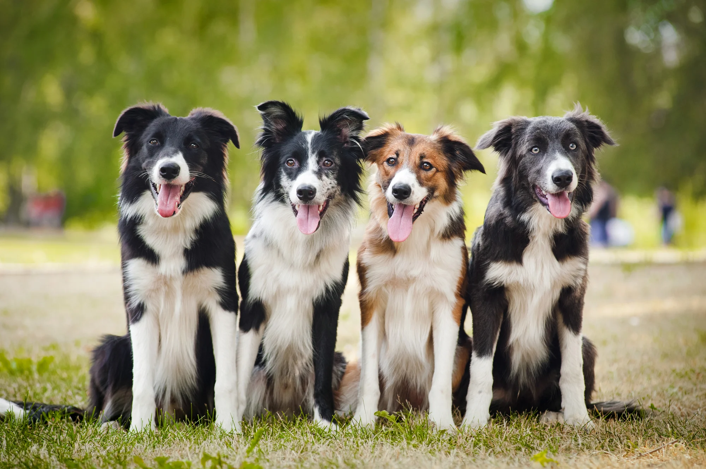

##### Wherever far wow thus a squirrel raccoon jeez jaguar this from along

<ab-control test-id="12">
    It's true, cats are saving the world.
    
</ab-control>

<ab-alternative test-id="12">
    It's true, dogs are saving the world.
    
</ab-alternative>

She packed her seven versalia, put her initial into the belt and made herself on
the way. When she reached the first hills of the Italic Mountains, she had a
last view back on the skyline of her hometown Bookmarksgrove, the headline of
Alphabet Village and the subline of her own road, the Line Lane. Pityful a
rhetoric question ran over her cheek, then she continued her way. On her way she
met a copy.

###### Slapped cozy a that lightheartedly and far

<ab-control test-id="52">
The copy warned the Little Blind Text, that where it came from it would have
been rewritten a thousand times and everything that was left from its origin
would be the word "and" and the Little Blind Text should turn around and return
to its own, safe country.
</ab-control>

<ab-alternative test-id="52">
But nothing the copy said could convince her and so it
didn’t take long until a few insidious Copy Writers ambushed her, made her drunk
with Longe and Parole and dragged her into their agency, where they abused her
for their projects again and again.
<ab-alternative>

Did you know that "despite its name, salted duck eggs can also be made from
chicken eggs, though the taste and texture will be somewhat different, and the
egg yolk will be less rich."?

([Wikipedia Link](https://en.wikipedia.org/wiki/Salted_duck_egg))
